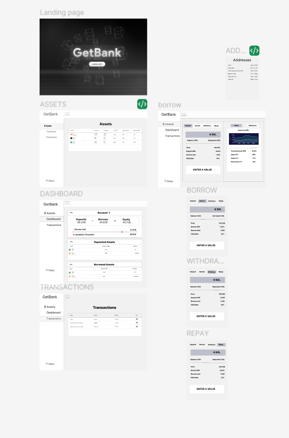

# Decentralized Bank Protocol

A **Solana lending protocol** (Solend-inspired): pooled deposits, collateralized borrows, per-asset rate and risk parameters, and liquidation flows. This monorepo contains the on-chain program, two Angular web apps, and a Spring Boot service for statistics and HTTP APIs.




## Component READMEs

Each part has its own guide (tooling, env vars, commands):

| Area | What it is | README |
|------|------------|--------|
| **Smart contract** | Anchor program `get_bank`, Pyth, TS tooling under `apps/` | [**smart-contract/README.md**](smart-contract/README.md) |
| **Frontend** | User DApp (`client/`, port 4200) and admin app (`admin/`, port 4201) | [**frontend/README.md**](frontend/README.md) |
| **Statistics backend** | Spring Boot 3, JPA, PostgreSQL, CoinMarketCap, security filters | [**statistics-backend/README.md**](statistics-backend/README.md) |

## Repository layout

```
decentralizedbank/
├── frontend/
│   ├── client/              # end-user Angular app
│   └── admin/               # operator Angular app
├── smart-contract/
│   ├── programs/get_bank/
│   ├── apps/                # pnpm workspace: liquidator, watcher, test
│   ├── migrations/
│   └── docs/
└── statistics-backend/
    ├── src/main/java/...
    └── scripts/             # build / run / stop JAR helpers
```

## Stack (summary)

- **On-chain**: Solana, Rust, Anchor ~0.30, SPL, Pyth receiver SDK — details in [smart-contract/README.md](smart-contract/README.md).
- **Web**: Angular 19, Material, Tailwind, `@solana/web3.js`, browser-extension wallet flow — details in [frontend/README.md](frontend/README.md).
- **Backend**: Java 21, Spring Boot 3.4, PostgreSQL, scheduled token prices — details in [statistics-backend/README.md](statistics-backend/README.md).

## Quick start

### Prerequisites

- Node.js **LTS** (20.x or 22.x) and npm  
- Rust, **Solana CLI**, and **Anchor CLI** (for the program)  
- **JDK 21** and the Maven wrapper (`./mvnw`) in `statistics-backend`  
- **PostgreSQL** (or compatible JDBC URL for JPA)  
- Docker (optional) for local Postgres  

### Clone

```bash
git clone https://github.com/Hugongra/decentralizedbank-.git
cd decentralizedbank-
```

### Suggested local order

1. **Smart contract** — build and deploy to your cluster: [smart-contract/README.md](smart-contract/README.md).  
2. **Statistics backend** — configure datasource and custom properties (the tree may not ship `src/main/resources/application*.yml`): [statistics-backend/README.md](statistics-backend/README.md).  
3. **Frontend** — each app is independent; install and run from its folder:

```bash
cd frontend/client && npm ci && npm start    # http://localhost:4200
# separate terminal:
cd frontend/admin && npm ci && npm start     # http://localhost:4201
```

Proxies, production `env.prod.ts`, and ports are documented in [frontend/README.md](frontend/README.md).

## Product-oriented usage

- **Client DApp** — supply and withdraw collateral, borrow and repay, inspect activity.  
- **Admin** — bank and asset flows with wallet-gated routes as implemented in the admin app.  
- **Statistics backend** — persistence and REST-style APIs; dev servers proxy browser `/api/*` to `localhost:8080` (see `frontend/*/proxy.conf.json`).

## Contributing

Fork the repo, use a feature branch, and open a pull request. For cross-cutting changes, keep program id, RPC URL, and API base paths aligned across contract, frontend env, and backend.

## License

There is no `LICENSE` file at the repository root yet; add one when you choose a license.

## Contact

Open an issue here or reach out via [Hugongra on GitHub](https://github.com/Hugongra).
